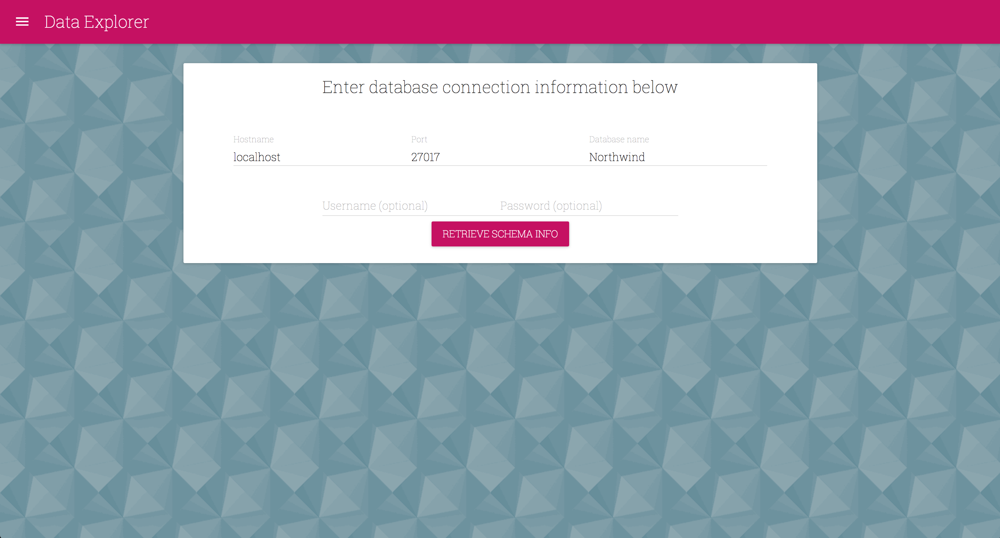
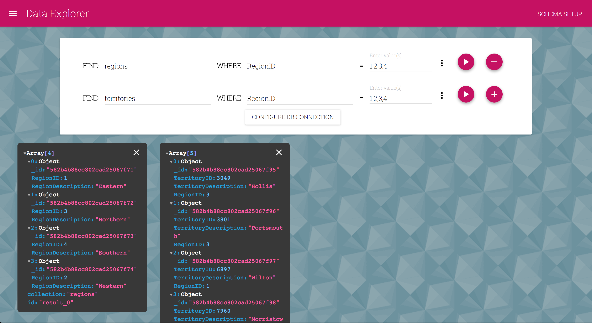

# data explorer

### Mongo client written in React with Material-UI components.
 
#### Retrieve your database schema information for easy querying (use auto-complete fields to define your collections / fields).  

#### Review results in intuitive tree-view, much like like Chrome DevTools.

Shout out to `mohsen1` @ https://github.com/mohsen1/json-formatter-js for his awesome json-formatter-js npm package!